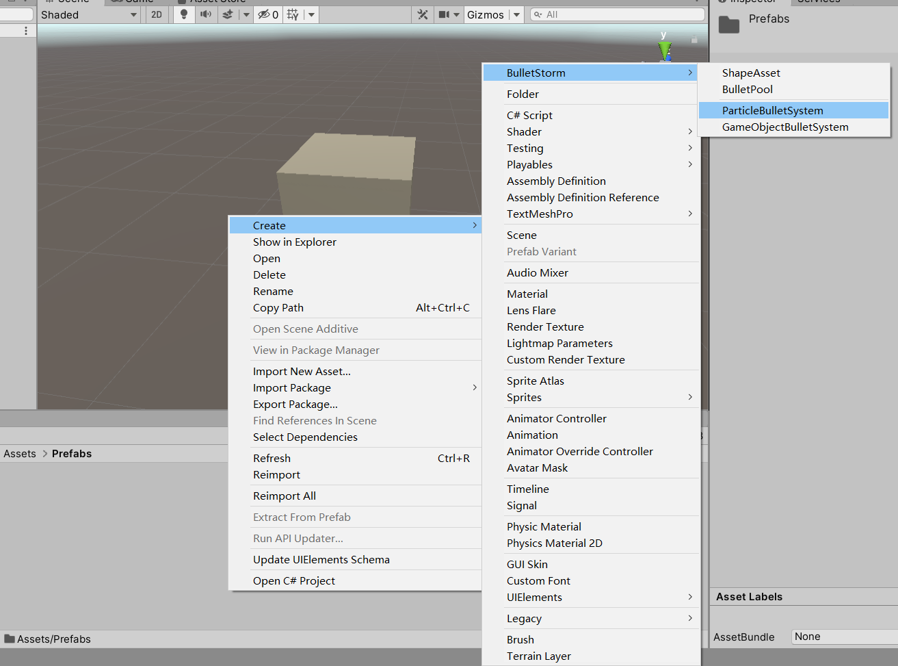
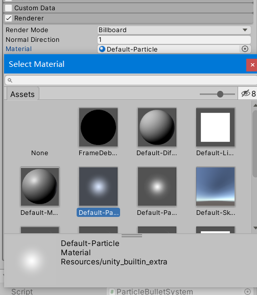
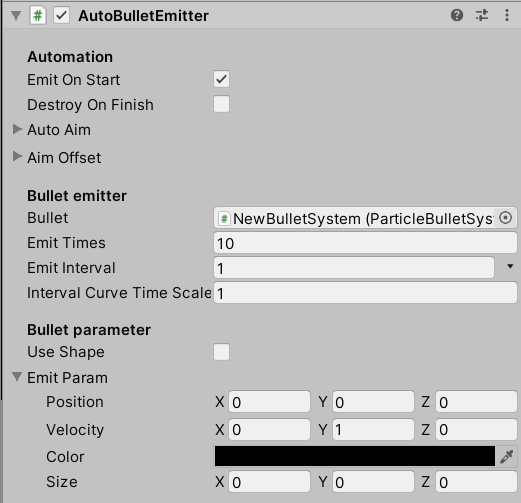

# 入门

这将教会您如何开始使用Bullet Storm。

## 安装

### 安装前准备

在使用Bullet Storm前，需要先安装Unity引擎：[下载Unity Hub](https://public-cdn.cloud.unity3d.com/hub/prod/UnityHubSetup.exe)

Bullet Storm支持Unity2019以上版本，建议使用2019.4LTS或2020最新版。

### 下载和安装

Bullet Storm是一款开源的插件，您可以从[GitHub](https://github.com/SUSTech-CANStudio/bullet-storm-unity)直接下载源码。

如果您不熟悉Git的操作，请直接点击Download ZIP，在下载的压缩包内找到`BulletStorm`文件夹，连同文件夹一起解压到您Unity项目的`Assets`文件夹下任意路径。

## 开始使用

打开Unity，进入您的项目，在Assets路径下创建一个文件夹

右键在文件夹空白处单击，在Create菜单下找到`BulletStorm`选项，创建一个`ParticleBulletSystem`

点击刚才创建的物品，检视面板中可以看见一个`ParticleSystem`组件和一个`ParticleBulletSystem`组件

我们设置一下`ParticleSystem`组件，点开`Renderer`选项栏，选择一个默认的Material

子弹的创建已经完成，接下来在场景菜单空白处点击右键，创建一个立方体

调整立方体的位置，使你的摄像机可以看见立方体

在刚才创建的立方体上点击右键，创建一个`AutoBulletEmitter`

选择刚才创建的发射器，在检视面板中勾选`Emit On Start`，并将刚才创建的子弹拖拽到`Bullet`一栏中，`Emit Interval`设置为1，在`Emit Param`中设置`Velocity`为（0，1，0）。整体设置完成后如下图：

点击开始游戏，即可看到效果

