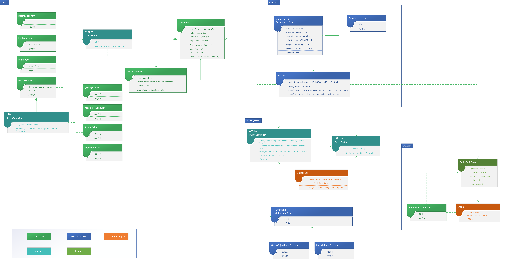

# bullet-storm-unity

Bullet Storm 是为3D STG游戏设计的弹幕系统，旨在简化弹幕游戏制作流程。
早先版本由于对需求的认知不够明确，代码整体结构出现了问题，因此该项目目前正在进行一次重构，调整类结构以符合未来开发的需要。

Bullet Storm is a better particle system designed for 3D STG games.
Due to not clear about demands during early development, there exists some problems with code structure. I am refactoring it to fit future development.

重构将以下图为大纲进行 My refactor will base on the outline below：

