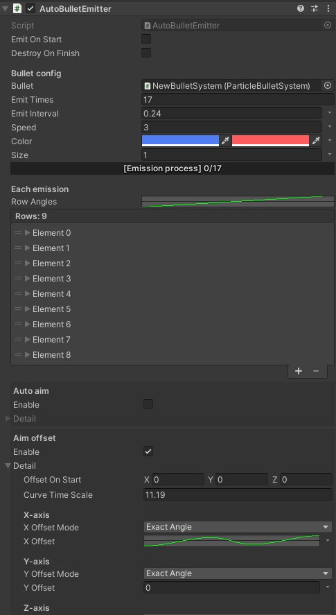

# BulletStorm

[](https://www.codacy.com/gh/SUSTech-CANStudio/bullet-storm-unity/dashboard?utm_source=github.com&amp;utm_medium=referral&amp;utm_content=SUSTech-CANStudio/bullet-storm-unity&amp;utm_campaign=Badge_Grade)[](https://openupm.com/packages/com.canstudio.bullet-storm/)

**点击查看[中文介绍](README-zh-CN.md)**

BulletStorm is an editor tool for *danmaku* (or say barrage) design in 3D STG games.

It provides full graphic user interface for your workflow, from emission to runtime control. You can easily design danmaku in your game without code knowledge base.

BulletStorm is a high level danmaku manage system, it doesn't care about how the danmaku is implemented. Every class (particle system, game object, or anything else) that implements `BulletSystem.IBulletSystem` can be a danmaku implementation. However, BulletStorm provides support for Unity build-in particle system and GameObject, so you don't need to implement them by yourself.

## Installation

BulletStorm is easy to install, you can use any of following methods to install it.

### OpenUPM (Recommended)

1. If you are new to OpenUPM, install [openupm-cli](https://github.com/openupm/openupm-cli#installation) first.

2. Go to your Unity project root folder (you can find an `Assets` folder under it), run this command:

   ```shell
   openupm add com.canstudio.bullet-storm
   ```

3. Open your Unity editor, BulletStorm should be installed successfully.

### UPM

1. If you haven't installed Git, download and install it here: [download Git](https://git-scm.com/downloads)

2. Open your Unity editor, open `Window -> Package Manager` in the toolbar.

3. In Package Manager, click `+ -> add package from git URL` in the top left corner.

4. Add following packages:

   `"com.dbrizov.naughtyattributes": "https://github.com/dbrizov/NaughtyAttributes.git#upm"`

   `"com.github.siccity.xnode": "https://github.com/siccity/xNode.git"`

   `"com.canstudio.bullet-storm": "https://github.com/SUSTech-CANStudio/bullet-storm-unity.git#upm"`

### Use this as template

If you are going to create a new project, you can simply use this repository as template.

1. Download source code in master branch with your favorite method.
2. Open it as Unity project.

## Overview

### Shape Editor


### Auto Emitters




### Build-in Particle System Support


