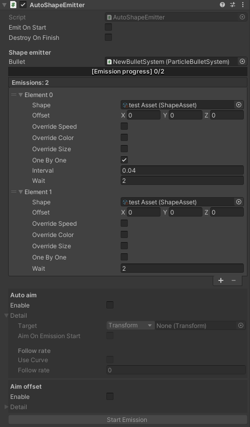

# BulletStorm

[](https://www.codacy.com/gh/SUSTech-CANStudio/bullet-storm-unity/dashboard?utm_source=github.com&amp;utm_medium=referral&amp;utm_content=SUSTech-CANStudio/bullet-storm-unity&amp;utm_campaign=Badge_Grade)[](https://openupm.com/packages/com.canstudio.bullet-storm/)

BulletStorm是用于3D STG游戏弹幕设计的编辑器工具，提供了从发射到运行时控制的完整图形用户界面，无需代码知识即可设计游戏中的弹幕。

BulletStorm是弹幕管理系统，但它的运行与弹幕的具体实现方式无关。 实现`BulletSystem.IBulletSystem`的每个类（粒子系统，游戏对象或其他任何东西）都可以是一个弹幕的实现。BulletStorm也为Unity内置粒子系统和GameObject提供原生支持，因此你不需要自己实现这两类弹幕。

## 安装

安装BulletStorm并不复杂，你可以选择以下任意一种方式进行安装：

### OpenUPM（推荐）

1. 如果你还没有使用过OpenUPM，请先安装[openupm-cli](https://github.com/openupm/openupm-cli#installation)。

2. 命令行转到Unity项目路径下（这个路径下应该有一个名为`Assets`的文件夹），输入并执行

   ```shell
   openupm add com.canstudio.bullet-storm
   ```

3. 打开Unity编辑器，BulletStorm将会成功安装。

### UPM

1. 如果没有安装Git，请先[下载 Git](https://git-scm.com/downloads)并安装。

2. 打开Unity编辑器，工具栏中打开`Window -> Package Manager`。

3. 在Package Manager窗口中，点击左上角的 `+ -> add package from git URL`以输入。

4. 添加下列upm包：

   `"com.dbrizov.naughtyattributes": "https://github.com/dbrizov/NaughtyAttributes.git#upm"`

   `"com.github.siccity.xnode": "https://github.com/siccity/xNode.git"`

   `"com.canstudio.bullet-storm": "https://github.com/SUSTech-CANStudio/bullet-storm-unity.git#upm"`

### 作为模板使用

如果你想创建一个新的Unity项目，也可以直接用源码作为模板

1. 用任意方式下载master分支的源码。
2. 作为Unity项目打开即可。

## 预览

### 形状编辑器


### 自动发射器



### 对Unity自带粒子系统的支持


